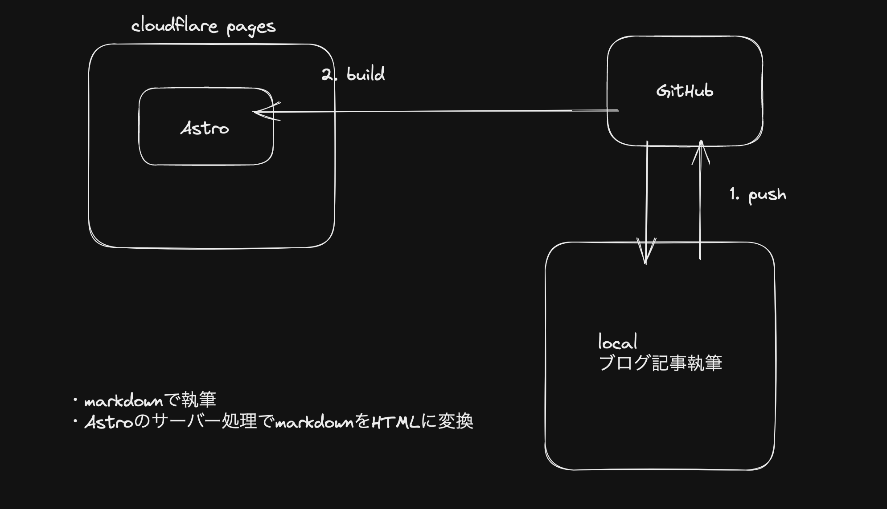

# My Blog

## setup

### astro

```
npm create astro@latest  
```

### tailwind

```
npx astro add tailwind
```

~~microCMS SDK~~(使用やめた)

```
npm install microcms-js-sdk
```

### zenn markdown

```
npm i zenn-markdown-html
npm i zenn-content-css
```

