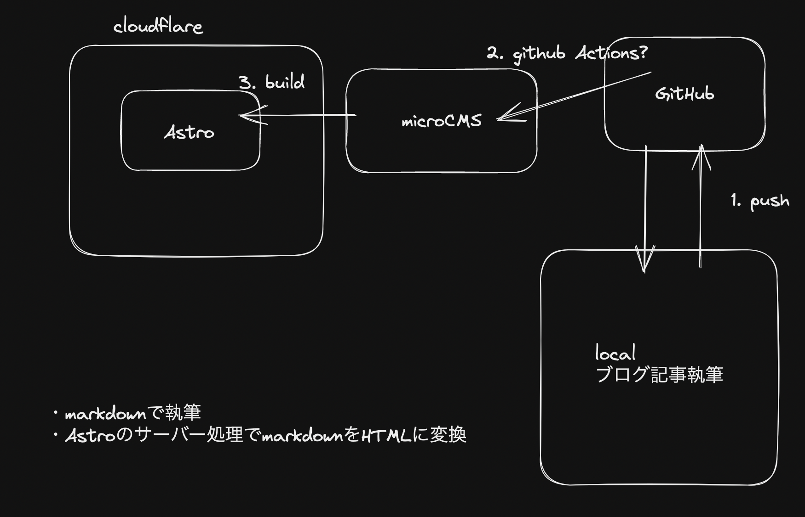

# My Blog

## setup

### astro

```bash
npm create astro@latest
```

### tailwind

```bash
npx astro add tailwind
```

~~microCMS SDK~~(使用やめた)

```bash
npm install microcms-js-sdk
```

### zenn markdown

```bash
npm i zenn-markdown-html
npm i zenn-content-css
```

### Google Analyticsの導入

```bash
npm install -D @astrojs/partytown
```


